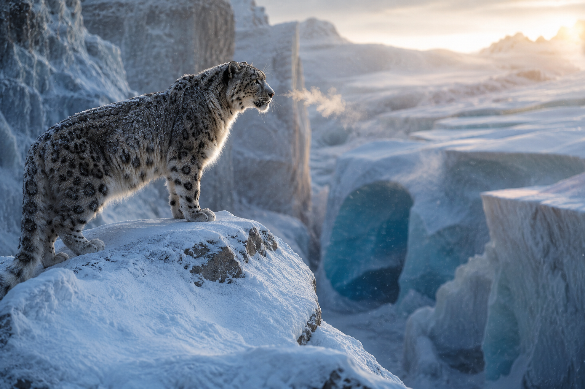
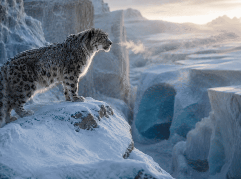
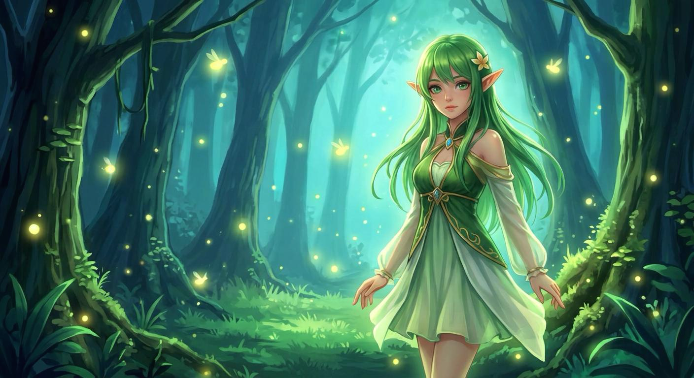

# 2026-05-29

### Updates

- **Image-to-Video generation:** We have added support for **Image-to-Video generation**.
- **Prompt-conditioned motion:** The task uses an input first-frame image together with a text prompt, keeping the image content as the visual anchor while generating temporally coherent motion.
- **Optional prompt enhancement:** `ENHANCE_PROMPT` can be enabled for T2V/I2V prompt rewrite. For I2V, the rewrite uses both the input text and the first-frame image.

```bash
bash inference_lance.sh \
  --TASK_NAME i2v \
  --MODEL_PATH downloads/Lance_3B_Video \
  --RESOLUTION video_480p \
  --NUM_FRAMES 61 \
  --VIDEO_HEIGHT 480 \
  --VIDEO_WIDTH 848 \
  --SAVE_PATH_GEN results/i2v
```

### Examples

<table>
  <tr>
    <th align="center">First Frame</th>
    <th align="center">Generated Video</th>
  </tr>
  <tr>
    <td align="center" width="45%">
      
    </td>
    <td align="center" width="55%">
      
    </td>
  </tr>
  <tr>
    <td align="center" width="45%">
      
    </td>
    <td align="center" width="55%">
      
    </td>
  </tr>
</table>
